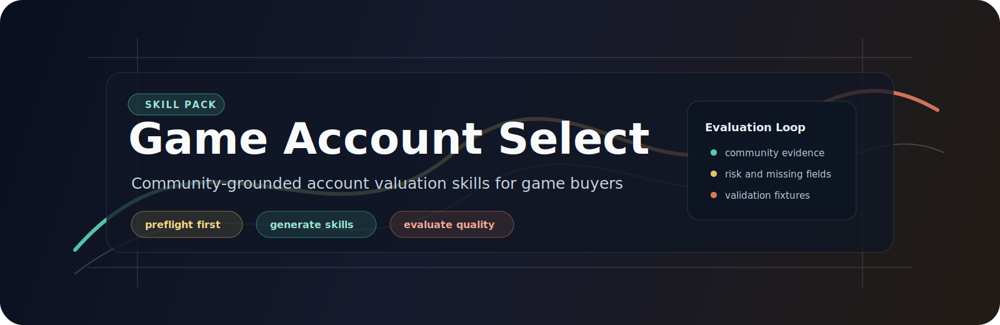

<p align="center">
  
</p>

# Game Account Select

<p align="center">
  <em>Community-grounded account valuation skills for game buyers.</em>
</p>

<p align="center">
  <a href="README.md">简体中文</a>
  ·
  <a href="README.en.md"><strong>English</strong></a>
</p>

<p align="center">
  <a href="#install"></a>
  <a href="#skills"></a>
  <a href="#automatic-preflight"></a>
  <a href="LICENSE"></a>
</p>

Game Account Select is a portable Agent Skills pack for buying game accounts more carefully. It turns account listings, screenshots, seller descriptions, and community guide evidence into structured recommendations with visible risk, missing-field, and rule-update notes.

It is not a trading platform and does not place orders. The goal is to help an agent explain which listings deserve attention, which listings are weak despite impressive-looking asset counts, and which claims need manual verification before purchase.

<p align="center"><sub><a href="#install">Install</a> · <a href="#skills">Skills</a> · <a href="#workflow">Workflow</a> · <a href="#standard-io">I/O</a> · <a href="#maintenance">Maintenance</a> · <a href="#safety">Safety</a> · <a href="#license">License</a></sub></p>

## Install

Install every skill in the repository:

```bash
npx skills add https://github.com/PointMountain/game-account-select
```

Install only the skills you need by passing the exact install name from the `name:` field in each `SKILL.md`:

```bash
npx skills add https://github.com/PointMountain/game-account-select --skill "game-account-select"
npx skills add https://github.com/PointMountain/game-account-select --skill "game-account-zenless-zone-zero"
```

List the available install names from a local checkout:

```bash
npm run list:skills
```

## Skills

| Install name | Role | Use when |
| --- | --- | --- |
| `game-account-select` | Main selector | You want the full account screening workflow from user requirements to ranked recommendations. |
| `game-account-preflight` | Automatic preparation | Another account skill starts execution and needs to verify tools, browser access, and missing dependencies. |
| `game-account-toolkit` | Shared toolkit | A game skill needs the common I/O contract, platform access policy, community research protocol, or dependency helpers. |
| `game-account-skill-generator` | Game skill generator | The requested game is not supported yet and needs a conservative baseline buying skill. |
| `game-account-skill-evaluator` | Quality gate | A generated or edited game skill must be checked before real account recommendations. |
| `game-account-community-updater` | Evidence refresh | Current community consensus is stale, missing, or version-sensitive. |
| `game-account-wuthering-waves` | Wuthering Waves / Mingchao | Listings for Wuthering Waves accounts need role, weapon, resonance, resource, and binding-risk scoring. |
| `game-account-arknights` | Arknights | Listings need operator, limited/collab, mastery/module, resource, skin, and real-name risk scoring. |
| `game-account-neverness-to-everness` | Neverness to Everness | Listings need named S-character, arc, awakening, resource, and account-type scoring. |
| `game-account-zenless-zone-zero` | Zenless Zone Zero / ZZZ | Listings need limited agent, signature W-Engine, team, Polychrome/tape, Bangboo, and binding-risk scoring. |

## Workflow

```text
User request
  -> game-account-select
  -> automatic game-account-preflight
  -> game-account-toolkit
  -> matching game skill or game-account-skill-generator
  -> game-account-skill-evaluator
  -> ranked recommendations, risks, missing fields, and rule-update suggestions
```

1. The user gives the game, budget, server, target assets, risk preference, and listing sources.
2. `game-account-select` normalizes the request and starts `game-account-preflight` automatically.
3. `game-account-toolkit` chooses the safest available access route for user-provided pages, screenshots, OCR text, or public listing snippets.
4. The matching game skill scores the account against game-specific rules and community evidence.
5. If no game skill exists, `game-account-skill-generator` creates a conservative baseline skill and `game-account-skill-evaluator` decides whether it is usable.
6. The final answer includes recommendation ranking, reasons to avoid listings, missing seller fields, and rule-update suggestions.

## Automatic Preflight

Users should not run a separate "before use" command. Every entry skill is written to call `game-account-preflight` as the first execution step.

Preflight checks Node.js, git, GitHub CLI, browser/CDP access, `opencli`, `web-access`, and project-local dependency state. It can safely report missing tools and run repo-local checks, but it does not silently install global software or modify installed Codex skills.

## Standard I/O

All account skills share the contract in `skills/game-account-toolkit/references/skill-io-contract.md`.

Preferred input tags:

- `<game_account_request>`
- `<account_listing>`
- `<community_evidence>`
- `<skill_generation_request>`

Preferred output tags:

- `<game_account_evaluation>`
- `<recommendations>`
- `<skill_quality_report>`
- `<community_refresh_report>`

This keeps each skill thin: `SKILL.md` defines the entry behavior, `references/` stores rules and evidence, `scripts/` stores repeatable validation, and `test-fixtures/` stores offline samples.

## Generate A New Game Skill

Ask the installed skill to generate a buying skill for a new game:

```text
Use game-account-skill-generator to create an account-buying skill for <game>, then evaluate it before using it for recommendations.
```

Maintainers can run the deterministic generator script from a checkout:

```bash
node skills/game-account-skill-generator/scripts/generate-game-skill.mjs --game "Test Frontier" --out /tmp/game-account-generator-test --force
node /tmp/game-account-generator-test/skills/game-account-test-frontier/scripts/validate-sample.mjs
```

Generated skills start with low confidence until their community evidence, scoring rules, fixtures, and evaluator report pass the quality gate.

## Maintenance

These commands are for repository maintainers and CI-style verification. They are not required before a normal user invokes a skill.

```bash
npm run list:skills
npm run verify:skills
node skills/game-account-preflight/scripts/preflight.mjs --json
node skills/game-account-skill-evaluator/scripts/evaluate-skill.mjs skills/game-account-wuthering-waves --json
node skills/game-account-community-updater/scripts/update-community-evidence.mjs --skill skills/game-account-zenless-zone-zero --evidence skills/game-account-community-updater/test-fixtures/evidence-sample.json --out /tmp/community-refresh-test
```

Community evidence can refresh in two ways:

- Execution-time refresh when the listing mentions assets that are missing from the local snapshot, a major version has changed, or the user asks for current community coverage.
- Maintainer refresh through `game-account-community-updater` when curated evidence JSON should be written into a game skill before future runs.

Evidence refresh updates `community-evidence.md` and the refresh report. It should not silently rewrite valuation weights; rule changes should be proposed, reviewed, and then recorded in the game skill changelog.

## Safety

- Do not automate purchases or trading decisions.
- Do not bypass captcha, login restrictions, platform rate limits, or anti-bot controls.
- Do not treat publicly visible listings as permission for broad scraping.
- Do not rank accounts highly from raw rare-asset counts alone.
- Do not hide binding, real-name, PSN/TAP/Wegame/HoYoverse, recovery, or guarantee-risk gaps.
- Do not silently modify valuation rules after user feedback; propose the exact rule update first.

## License

[MIT License](LICENSE) © 2026 PointMountain
