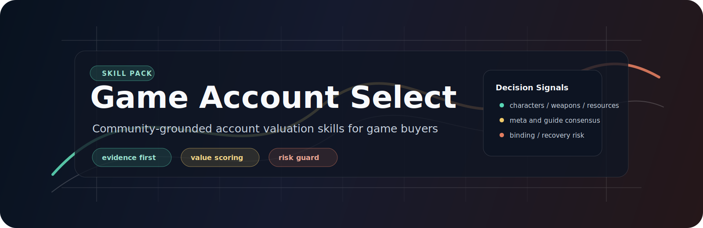
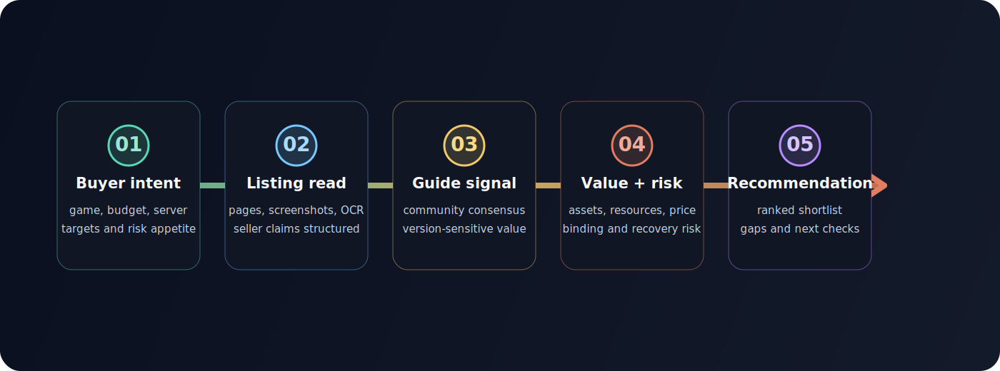

<p align="center">
  
</p>

# Game Account Select

<p align="center">
  
</p>

<p align="center">
  <em>Agent skills for anime-game account screening, valuation, and purchase-risk review.</em>
</p>

<p align="center">
  <a href="README.md">简体中文</a>
  ·
  <strong>English</strong>
</p>

<p align="center">
  <a href="#install"></a>
  <a href="#skills"></a>
  <a href="#design-philosophy"></a>
  <a href="LICENSE"></a>
</p>

Game Account Select helps you turn seller descriptions, screenshots/OCR, account assets, and community guide consensus into a comparable shortlist before buying a game account. It cares less about raw five-star, six-star, or S-rank counts, and more about whether those assets are actually valuable in the current version, whether the team is usable, whether resources are sufficient, and whether binding/recovery risk is clear.

It is not a trading platform and does not place orders. It is built to remove risky listings quickly, surface the accounts worth checking further, and make the reasoning and uncertainty behind every recommendation visible.

<p align="center"><sub><a href="#install">Install</a> · <a href="#what-it-helps-with">Capabilities</a> · <a href="#account-screening-flow">Flow</a> · <a href="#skills">Skills</a> · <a href="#design-philosophy">Philosophy</a> · <a href="#maintenance">Maintenance</a> · <a href="#safety">Safety</a> · <a href="#license">License</a></sub></p>

## Install

Recommended: install the full pack so the selector, preflight check, shared toolkit, community refresh, and every supported game skill are available together:

```bash
npx skills add https://github.com/PointMountain/game-account-select --skill '*'
```

Without `--skill`, `npx skills` opens an interactive selector:

```bash
npx skills add https://github.com/PointMountain/game-account-select
```

If you only want one game, select these items in the interactive selector:

- The game skill you need, for example `game-account-zenless-zone-zero`
- `game-account-toolkit`
- `game-account-preflight`
- `game-account-skill-optimizer`
- `game-account-community-updater`

You can also use a bundle command:

```bash
npx skills add https://github.com/PointMountain/game-account-select \
  --skill "game-account-toolkit" \
  --skill "game-account-preflight" \
  --skill "game-account-skill-optimizer" \
  --skill "game-account-community-updater" \
  --skill "game-account-zenless-zone-zero"
```

From a local checkout, generate full commands for common install profiles:

| Goal | Command |
| --- | --- |
| Core helpers only | `node scripts/list-skills.js --profile core` |
| Optimizer only | `node scripts/list-skills.js --profile optimization` |
| Zenless Zone Zero only | `node scripts/list-skills.js --profile zenless-zone-zero` |
| Wuthering Waves only | `node scripts/list-skills.js --profile wuthering-waves` |
| New game generation and evaluation | `node scripts/list-skills.js --profile new-game-authoring` |

List all install names and profiles from a local checkout:

```bash
npm run list:skills
npm run list:profiles
```

For local development, symlink this checkout into `~/.agents/skills` so your local agent reads the latest workspace copy:

```bash
npm run link:skills
npm run unlink:skills
```

## What It Helps With

| Scenario | What Game Account Select focuses on |
| --- | --- |
| A listing looks rare but you cannot tell whether it is valuable | Separates limited/core assets from standard-pool traps and low-value dupes. |
| Seller text is messy and screenshots are incomplete | Normalizes characters, weapons/engines/arcs, resources, server, binding, and verification fields. |
| Each game has different account-value logic | Maintains separate game rules instead of applying one generic rarity rule to every game. |
| Community meta changes quickly | Uses evidence snapshots and refresh reports to show version context, coverage gaps, and confidence. |
| Real-name, binding, and recovery risk matter | Makes risk deductions visible and lists fields that must be confirmed with the seller. |

## Account Screening Flow

<p align="center">
  
</p>

| Node | Meaning |
| --- | --- |
| Buyer intent | Capture game, budget, server, target assets, and risk appetite so the shortlist has a real goal. |
| Listing read | Accept platform pages, screenshots, OCR text, or seller descriptions and normalize loose claims into comparable fields. |
| Guide signal | Use high-signal community content from Bilibili, Douyin, Xiaohongshu, guide sites, and search surfaces to build version context. |
| Value + risk | Score assets, resources, price fit, binding risk, recovery risk, and verification gaps together. |
| Recommendation | Return ranked candidates, rejection reasons, missing fields, manual checks, and rule-update suggestions. |

## Skills

| Install name | Role | Use when |
| --- | --- | --- |
| `game-account-select` | Main selector | You want the full account screening workflow from user requirements to ranked recommendations. |
| `game-account-preflight` | Readiness check | The workflow needs clear guidance when browser access, network access, or local tools are missing. |
| `game-account-toolkit` | Shared toolkit | A game skill needs shared fields, platform boundaries, community research protocol, or reusable templates. |
| `game-account-skill-generator` | Game skill generator | The requested game is not supported yet and needs a conservative baseline buying skill. |
| `game-account-skill-evaluator` | Quality gate | A generated, edited, or optimizer-produced skill must be checked before real account recommendations; low scores are sent back for redo. |
| `game-account-skill-optimizer` | Run optimizer | Analyzes screening and repository-skill runs for slow paths, empty results, source coverage gaps, output-format issues, valuation misses, user feedback, and quality-gate failures. |
| `game-account-community-updater` | Evidence refresh | Current community consensus is stale, missing, or version-sensitive. |
| `game-account-wuthering-waves` | Wuthering Waves / Mingchao | Listings need limited-character value, signature weapons, pull resources, and TAP/Wegame/PS5 binding risk. |
| `game-account-arknights` | Arknights | Listings need limited/collab operators, key progression, mastery/modules, resources, collection value, and real-name recovery risk. |
| `game-account-neverness-to-everness` | Neverness to Everness | Listings need named S characters, S arc plates, awakening, resources, protagonist/account type, and early-market risk. |
| `game-account-zenless-zone-zero` | Zenless Zone Zero / ZZZ | Listings need limited S agents, signature W-Engines, team completeness, Polychrome/tapes/Boopons, and HoYoverse/PSN/TAP binding risk. |

## Design Philosophy

**Goal-driven, not asset-count driven.** Start from what the buyer actually wants, then map account evidence to that goal. Raw rarity counts are only supporting signals; they should not override team completeness, version value, or risk state.

**Evidence before scoring.** Build the current-version context first: guide consensus, combat environment, character/weapon value, and buyer-risk anecdotes. When evidence is weak, confidence should drop instead of turning gaps into certainty.

**Transparent and reviewable.** Every recommendation should explain why an account is worth checking and why it might be a bad buy. Missing screenshots, missing resources, unclear verification, and binding risk are visible manual-check items.

**Self-evolving harness.** Every run leaves a diagnosable artifact: platform attempts, timings, failure text, output, user feedback, and evaluator results. The optimizer handles troubleshooting and target-file routing; the evaluator enforces the quality gate. Low scores, blocking issues, or `redo_required: true` must loop back into redo before the skill is used for real recommendations.

**Safety boundaries first.** This pack only supports pre-purchase judgment. It does not bypass platform limits, run high-frequency scraping, or automate trades. Evidence and rules can evolve, but rule changes should be explainable, verifiable, and traceable.

## Standard I/O

All account skills share the contract in `skills/game-account-toolkit/references/skill-io-contract.md`.

- Inputs: `<game_account_request>`, `<account_listing>`, `<community_evidence>`, `<skill_generation_request>`
- Outputs: `<game_account_evaluation>`, `<recommendations>`, `<skill_quality_report>`, `<community_refresh_report>`, `<skill_optimization_report>`

This keeps each skill thin: `SKILL.md` defines entry behavior, `references/` stores rules and evidence, `scripts/` stores repeatable validation, and `test-fixtures/` stores offline samples.

## Generate A New Game Skill

Ask the installed skill to generate a buying skill for a new game:

```text
Use game-account-skill-generator to create an account-buying skill for <game>, then evaluate it before using it for recommendations.
```

Maintainers can run the deterministic generator script from a checkout:

```bash
node skills/game-account-skill-generator/scripts/generate-game-skill.mjs --game "Test Frontier" --out /tmp/game-account-generator-test --force
node /tmp/game-account-generator-test/skills/game-account-test-frontier/scripts/validate-sample.mjs
```

Generated skills start with low confidence until their community evidence, scoring rules, fixtures, and evaluator report pass the quality gate.

## Maintenance

These commands are for repository maintainers and CI-style verification:

```bash
npm run list:skills
npm run verify:skills
npm run verify:frontmatter
npm run opencli:adapters:check
node skills/game-account-toolkit/scripts/install-opencli-adapters.mjs --install
node skills/game-account-preflight/scripts/preflight.mjs --json
node skills/game-account-preflight/scripts/preflight.mjs --json --opencli-adapters
node skills/game-account-skill-evaluator/scripts/evaluate-skill.mjs skills/game-account-wuthering-waves --json
node skills/game-account-skill-optimizer/scripts/analyze-run.mjs --input skills/game-account-skill-optimizer/test-fixtures/wuthering-waves-77175988-run.json --json
node skills/game-account-skill-optimizer/scripts/analyze-run.mjs --input skills/game-account-skill-optimizer/test-fixtures/zenless-zone-zero-run.json --json
node skills/game-account-skill-evaluator/scripts/evaluate-skill.mjs --from-report=skills/game-account-skill-optimizer/test-fixtures/optimizer-report-sample.json --json
node skills/game-account-community-updater/scripts/update-community-evidence.mjs --skill skills/game-account-zenless-zone-zero --evidence skills/game-account-community-updater/test-fixtures/evidence-sample.json --out /tmp/community-refresh-test
```

`game-account-toolkit` carries repo-managed Pxb7/PZDS OpenCLI adapters under `skills/game-account-toolkit/opencli-adapters/`. Commands are grouped by game, for example `pxb7/zzz-detail` and `pzds/zzz-detail` for Zenless Zone Zero. They are never installed silently. Use the check/install commands above to sync them into `~/.opencli`; pass `--force` only after reviewing an existing different local adapter.

Community evidence can refresh in two ways:

- Execution-time refresh when the listing mentions assets missing from the local snapshot, a major version changes, or the user asks for current community coverage.
- Maintainer refresh through `game-account-community-updater` when curated evidence JSON should be written into a game skill before future runs.

Evidence refresh updates `community-evidence.md` and the refresh report. It should not silently rewrite valuation weights; rule changes should be proposed, reviewed, and then recorded in the game skill changelog.

The optimizer can run after a real screening session or from a maintainer-provided JSON artifact. It reports recommended improvements by default; it does not silently rewrite skills unless the user explicitly asks to apply the changes and the corresponding validation scripts and evaluator gate pass. Optimized skills below the quality threshold must be redone.

## Safety

- Do not automate purchases or trading decisions.
- Do not bypass captcha, login restrictions, platform rate limits, or anti-bot controls.
- Do not treat publicly visible listings as permission for broad scraping.
- Do not rank accounts highly from raw rare-asset counts alone.
- Do not hide binding, real-name, PSN/TAP/Wegame/HoYoverse, recovery, guarantee, or verification gaps.
- Do not silently modify valuation rules after user feedback; propose the exact rule update first.

## License

[MIT License](LICENSE) © 2026 PointMountain
