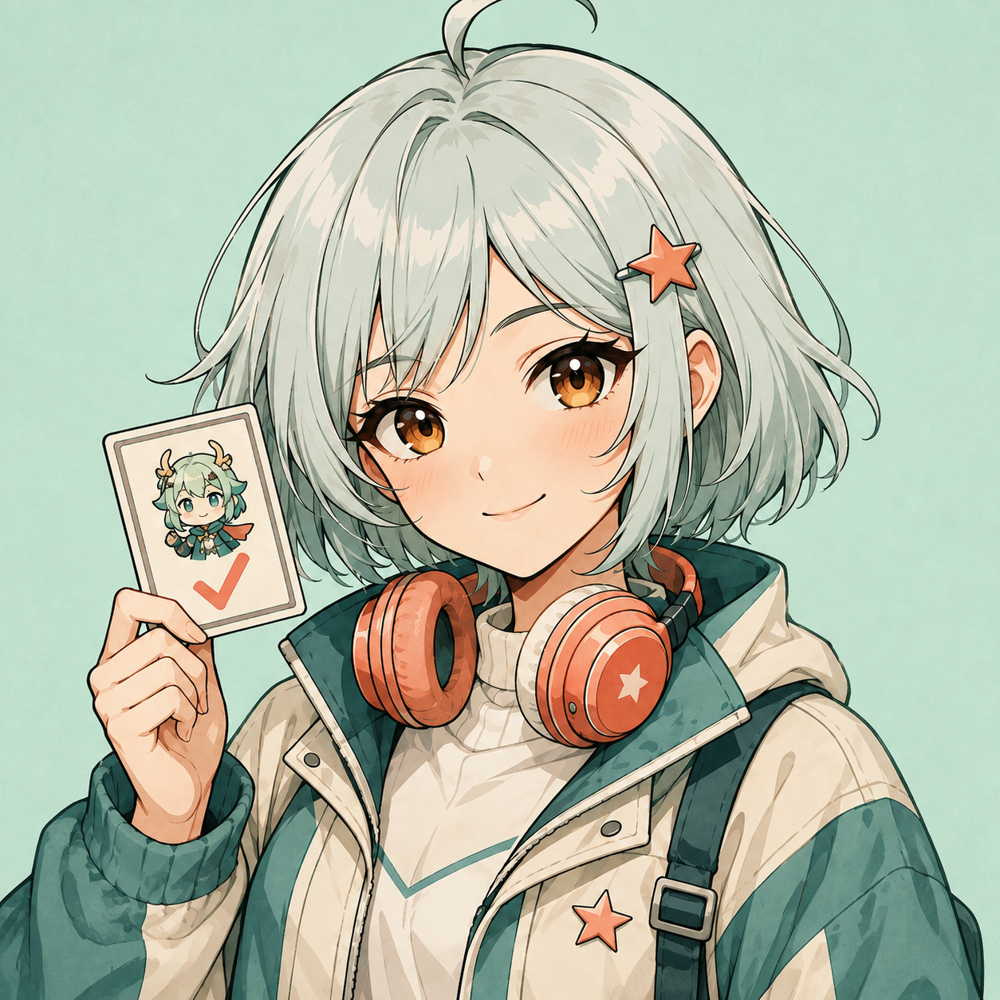
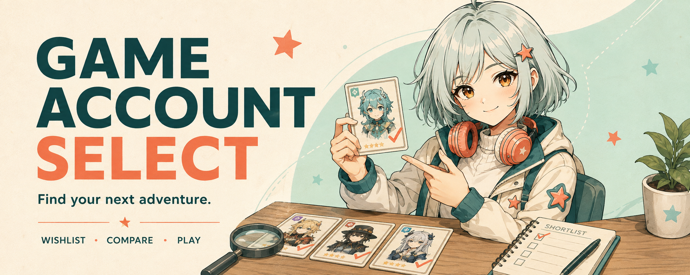
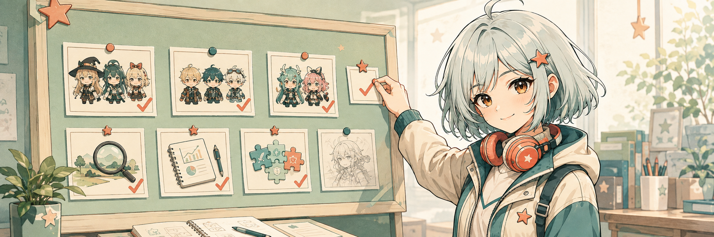
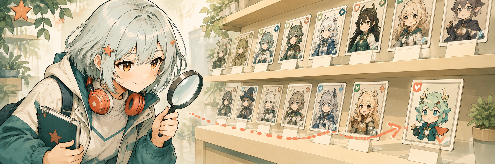
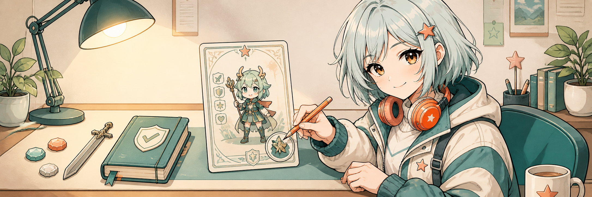
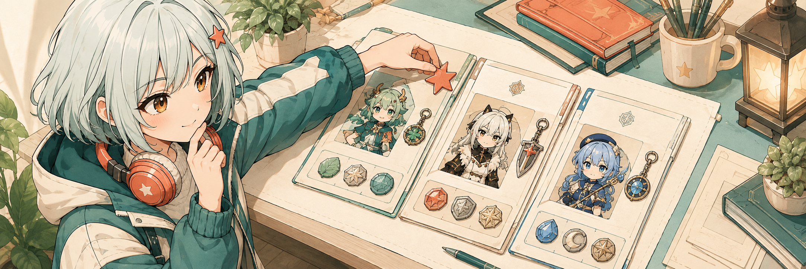
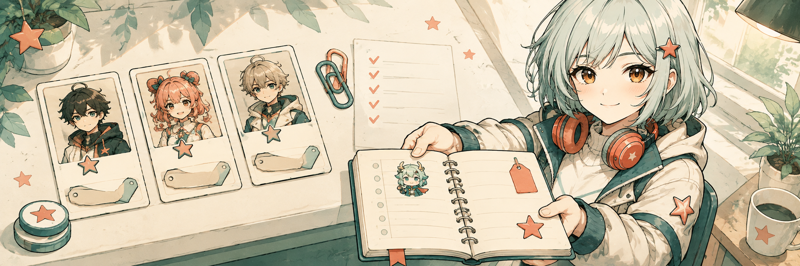
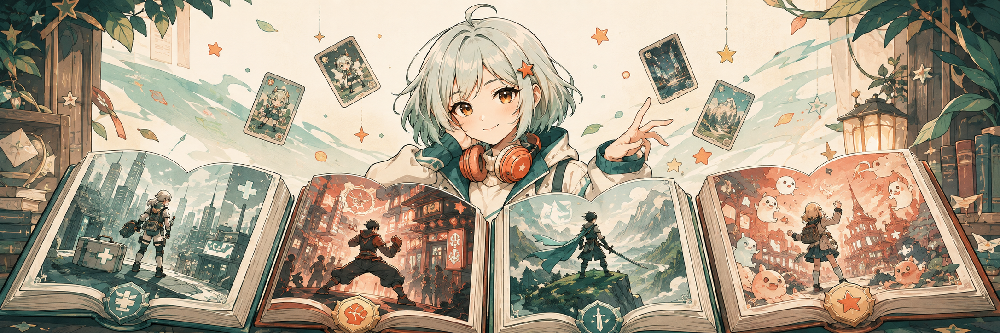
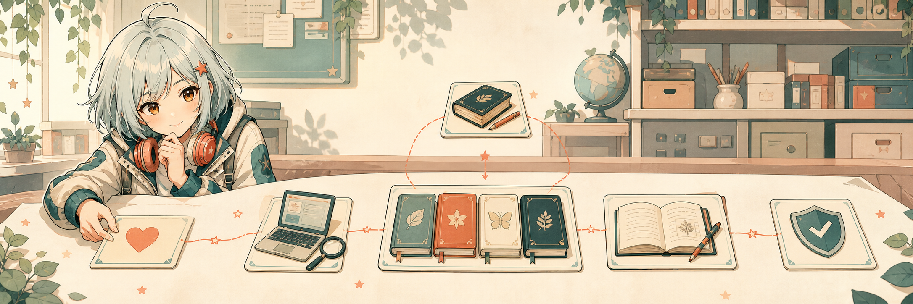
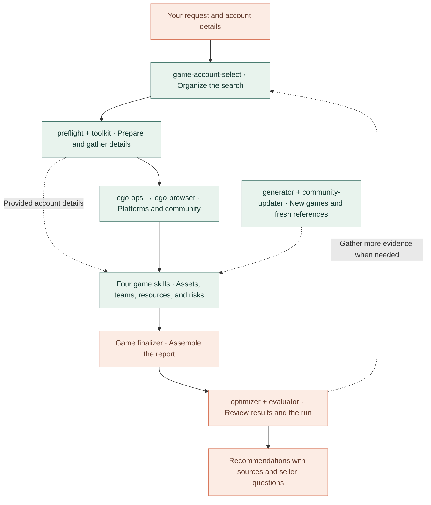

<p align="center">
  
</p>

<h1 align="center">Game Account Select</h1>

<p align="center">
  <strong>Find an account that feels like yours.</strong><br />
  Give your AI a wishlist. Let it find listings, compare prices, and check teams.
</p>

<p align="center">
  <a href="README.md">简体中文</a> · <strong>English</strong><br />
  <a href="#project-status">Status</a> · <a href="#install">Install</a> · <a href="#try-a-prompt">Usage</a> · <a href="#supported-games">Games</a> · <a href="#project-architecture">Architecture</a> · <a href="https://github.com/PointMountain/game-account-select/issues">Feedback</a>
</p>

<p align="center">
  <a href="skills/"></a>
  <a href="LICENSE"></a>
</p>

<p align="center">
  
</p>

Game Account Select is a set of game-account skills for tools that support Agent Skills, such as Codex and Claude Code. Share your game, budget, and favorite characters to get a comparison with listing links, prices, recommendations, and questions to ask the seller.

## Project Status

<p align="center">
  
</p>

The project is available as an **Agent Skills pack**, with repository version **v0.1.0** and four games integrated. Follow development through the links below.

[](https://github.com/PointMountain/game-account-select/actions/workflows/verify-game-account-skills.yml)
[](https://github.com/PointMountain/game-account-select/commits/main/)
[](https://github.com/PointMountain/game-account-select/issues)

- [x] All 11 skills available in one install.
- [x] Account evaluation and comparison for Arknights, ZZZ, Wuthering Waves, and NTE.
- [x] Searches guided by your budget and preferences, with sources for each candidate.
- [x] Community refreshes, new-game skill generation, run reviews, and regression checks.
- [x] Listing search, detail reads, and comparisons across PXB7 and PZDS for all four games.

See the [changelog](changelogs/), [project activity](https://github.com/PointMountain/game-account-select/pulse), and [issues](https://github.com/PointMountain/game-account-select/issues) for ongoing work.

## Install

<p align="center">
  
</p>

With **Node.js 22+** installed, run this command and choose your agent when prompted:

```bash
npx skills add https://github.com/PointMountain/game-account-select --skill '*'
```

This installs all 11 skills. Start a new agent session after installation.

**For online searches**, set up the [ego lite](https://lite.ego.app/) browser and install or link the `ego-browser` and `ego-ops` skills, including the relevant platform operations. Start with this prompt to check what you need:

```text
Use game-account-preflight to check my account-search setup, including
Node.js, git, gh, ego-ops, and ego-browser. Tell me what to prepare next.
```

The [matching ego-ops version](https://github.com/PointMountain/jacky-skills/tree/98cd060110c630c78d7e1282e7834dd359aa171b/harness/ego-ops) includes both-platform operations for all four games. Ask your agent to check that these operations are present when installing or updating.

<details>
<summary>Choose individual skills / update</summary>

Open the interactive installer:

```bash
npx skills add https://github.com/PointMountain/game-account-select
```

For one game's account evaluations, select its game skill along with `game-account-toolkit`, `game-account-preflight`, `game-account-skill-optimizer`, `game-account-skill-evaluator`, and `game-account-community-updater`. Add `game-account-select` for finding listings.

Update your installed skills:

```bash
npx skills update
```

</details>

## Try a prompt

### Find me an account

<p align="center">
  
</p>

Include your **game, budget, server, and priorities**:

```text
Use game-account-select to find an Arknights account on the official
CN server for up to CNY 1,500. I care most about limited and collab
operators; enough progression for daily play is fine.
Compare listings on PXB7 and PZDS. Include prices, highlights, links,
and questions I should ask each seller.
```

### Is this one worth a look?

<p align="center">
  
</p>

Attach screenshots or paste the listing link or seller's description:

```text
Use game-account-zenless-zone-zero to review this ZZZ account at CNY 800.
I'd like two playable teams and some pulls saved for later.
Check the team options, signature W-Engines, and account bindings.
Is it worth considering at this price?

Account details: <paste a link or description, or attach screenshots>
```

### Help me choose between these

<p align="center">
  
</p>

```text
Use game-account-wuthering-waves to compare these three accounts.
Jinhsi is my favorite, so prioritize her team and signature weapon,
then look at the remaining pulls. Rank them for me and explain
the tradeoffs.

Account A: <link or details>
Account B: <link or details>
Account C: <link or details>
```

## What you get

<p align="center">
  
</p>

A comparison built around what matters to you:

| Your question | What the report includes |
| --- | --- |
| How much, and where? | Listing price, platform, and original link |
| Does it fit my wishlist? | Characters, teams, equipment, progression, and pulls |
| Which should I pick? | Ranking, each account's strengths, and price differences |
| What should I ask the seller? | Bindings, identity verification, inspection details, and missing screenshots or data |

Keep the conversation going with “raise my budget to CNY 2,000,” “I care more about skins,” or “take a closer look at the second one.”

## Supported games

<p align="center">
  
</p>

All four games support finding accounts, reading listing details, and comparing candidates on **both PXB7 and PZDS**. You can also provide account details for a direct review.

| Game | What it checks | Online search |
| --- | --- | --- |
| **Arknights** | Limited and collab operators, progression, masteries, modules, skins, resources | PXB7, PZDS |
| **Zenless Zone Zero** | Agents, Mindscapes, signature W-Engines, teams, Polychrome and tapes | PXB7, PZDS |
| **Wuthering Waves** | Resonators, Resonance Chains, signature weapons, teams, pulls | PXB7, PZDS |
| **Neverness to Everness** | S characters, S Arcs, awakenings, resources, account type | PXB7, PZDS |

For another game, try:

```text
Use game-account-skill-generator to create an account evaluation skill
for <game>. Gather community references and pass the quality checks,
then help me review some accounts.
```

## Project Architecture

<p align="center">
  
</p>

Think of the 11 skills as a small team: the entry skill understands your request, browser tools gather details, game skills evaluate each account, and the final review prepares your recommendations.


```mermaid
flowchart TD
    Request["Your request and account details"] --> Select["game-account-select · Organize the search"]
    Select --> Runtime["preflight + toolkit · Prepare and gather details"]
    Runtime --> Browser["ego-ops → ego-browser · Platforms and community"]
    Runtime -. "Provided account details" .-> Games
    Browser --> Games["Four game skills · Assets, teams, resources, and risks"]
    Extend["generator + community-updater · New games and fresh references"] -.-> Games
    Games --> Finalizer["Game finalizer · Assemble the report"]
    Finalizer --> Review["optimizer + evaluator · Review results and the run"]
    Review --> Report["Recommendations with sources and seller questions"]
    Review -. "Gather more evidence when needed" .-> Select
    classDef mint fill:#e8f3ed,stroke:#42766b,color:#183b34
    classDef coral fill:#fcece4,stroke:#d9795d,color:#643c2e
    class Select,Runtime,Browser,Games,Extend mint
    class Request,Finalizer,Review,Report coral
```

| Curious about… | Start here |
| --- | --- |
| How a search starts and delivers results | [The selector skill](skills/game-account-select/SKILL.md) |
| How each game evaluates accounts | [Arknights](skills/game-account-arknights/SKILL.md) · [ZZZ](skills/game-account-zenless-zone-zero/SKILL.md) · [Wuthering Waves](skills/game-account-wuthering-waves/SKILL.md) · [NTE](skills/game-account-neverness-to-everness/SKILL.md) |
| How browser tools, references, and modules work together | [Architecture notes](docs/development/architecture.md) |
| How to edit and validate skills | [Development workflow](docs/development/workflow.md) · [Learning loop](skills/game-account-skill-optimizer/references/learning-loop.md) |

<details>
<summary>More: refresh game advice / local development</summary>

To revisit character and equipment value after an update:

```text
Use game-account-community-updater to refresh the ZZZ community
references, then check whether my earlier account ranking changes.
```

From a local checkout, list skills and install bundles, or link your edits:

```bash
npm run list:skills
npm run list:profiles
npm run link:skills
```

Validate changes with the first two commands. Use the last one when you want to remove local links:

```bash
npm run dev:check
npm run verify:skills
npm run unlink:skills
```

See the [development workflow](docs/development/workflow.md) and [setup checklist](skills/game-account-preflight/references/preflight-checklist.md) for details.

</details>

---

Have a question or a game you'd like to add? [Open an issue](https://github.com/PointMountain/game-account-select/issues) with the game, what you're looking for, and what happened.

[MIT License](LICENSE) · Made for your next adventure.
