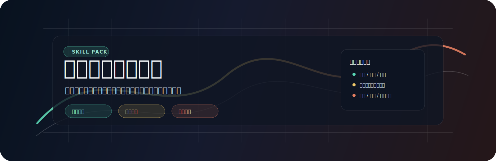
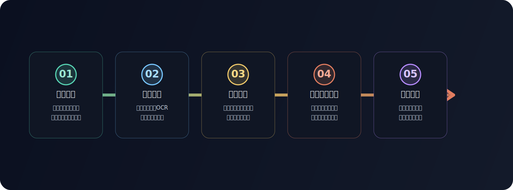

<p align="center">
  
</p>

# Game Account Select

<p align="center">
  
</p>

<p align="center">
  <em>面向二次元游戏买号场景的账号筛选、估值和避坑 Agent Skills。</em>
</p>

<p align="center">
  <strong>简体中文</strong>
  ·
  <a href="README.en.md">English</a>
</p>

<p align="center">
  <a href="#安装"></a>
  <a href="#skills"></a>
  <a href="#设计哲学"></a>
  <a href="LICENSE"></a>
</p>

Game Account Select 帮你在购买游戏账号前，把卖家描述、截图/OCR、账号资产和社区攻略共识整理成可比较的候选清单。它关注的不是“五星/六星/S 角色总数”，而是这些资产在当前版本里是否真的有价值、队伍是否成型、资源是否够用、绑定和找回风险是否清楚。

它不做交易撮合，也不替你自动下单。它适合用来快速排除高风险账号、发现真正值得继续核验的挂牌，并把每个推荐背后的依据和不确定性说清楚。

<p align="center"><sub><a href="#安装">安装</a> · <a href="#适合解决什么问题">功能</a> · <a href="#账号筛选流程">流程</a> · <a href="#skills">Skills</a> · <a href="#设计哲学">设计哲学</a> · <a href="#维护验证">维护验证</a> · <a href="#安全边界">安全边界</a> · <a href="#协议">协议</a></sub></p>

## 安装

推荐完整安装。这样主筛选、执行前检查、共享工具、社区刷新和所有已支持游戏都会一起可用：

```bash
npx skills add https://github.com/PointMountain/game-account-select --skill '*'
```

不带 `--skill` 时，`npx skills` 会打开交互式选择器：

```bash
npx skills add https://github.com/PointMountain/game-account-select
```

如果只想装某一个游戏，在交互式选择器里同时勾选：

- 你需要的游戏 skill，例如 `game-account-zenless-zone-zero`
- `game-account-toolkit`
- `game-account-preflight`
- `game-account-community-updater`

也可以直接使用组合命令：

```bash
npx skills add https://github.com/PointMountain/game-account-select \
  --skill "game-account-toolkit" \
  --skill "game-account-preflight" \
  --skill "game-account-community-updater" \
  --skill "game-account-zenless-zone-zero"
```

如果已经 clone 本仓库，可以生成常用组合的完整安装命令：

| 目标 | 命令 |
| --- | --- |
| 只装核心工具 | `node scripts/list-skills.js --profile core` |
| 只装绝区零 | `node scripts/list-skills.js --profile zenless-zone-zero` |
| 只装鸣潮 | `node scripts/list-skills.js --profile wuthering-waves` |
| 新游戏 skill 生成与评估 | `node scripts/list-skills.js --profile new-game-authoring` |

在本地 checkout 中列出所有 skill 和安装组合：

```bash
npm run list:skills
npm run list:profiles
```

本地开发时，可以把当前 checkout 软链接到 `~/.agents/skills`，让本机 Agent 直接读取工作区里的最新 skill：

```bash
npm run link:skills
npm run unlink:skills
```

## 适合解决什么问题

| 场景 | Game Account Select 关注的重点 |
| --- | --- |
| 挂牌看起来“稀有很多”，但不知道值不值 | 区分限定核心、常驻陷阱、高命/高潜是否真的有购买价值。 |
| 卖家描述很散，截图信息不完整 | 把角色、武器/音擎/弧盘、资源、区服、绑定、验号信息整理成统一字段。 |
| 不同游戏价值逻辑完全不同 | 每个游戏独立维护估值规则，避免用一套泛化稀有度规则套所有游戏。 |
| 社区版本评价变化快 | 用社区证据快照和刷新机制标注版本上下文、覆盖缺口和置信度。 |
| 担心实名、绑定、找回风险 | 在推荐前显式扣风险，并列出必须向卖家确认的字段。 |

## 账号筛选流程

<p align="center">
  
</p>

| 节点 | 说明 |
| --- | --- |
| 说清目标 | 输入游戏、预算、区服、目标角色/资源和风险偏好，先定义什么样的账号算“值得看”。 |
| 读取挂牌 | 接收平台页面、截图、OCR 文本或卖家描述，把松散信息整理成可比较字段。 |
| 对齐社区 | 结合 B 站、抖音、小红书、攻略站等高信号内容形成版本上下文，不让过期强度印象主导排序。 |
| 估值与扣风险 | 同时看资产价值、资源价值、价格适配和绑定/找回/验号风险。 |
| 输出推荐 | 给出候选排序、排除理由、缺失字段、人工核验点和规则更新建议。 |

## Skills

| 安装名 | 角色 | 适用场景 |
| --- | --- | --- |
| `game-account-select` | 主筛选编排 | 从用户预算、游戏目标、风险偏好和账号来源出发，输出候选账号排序与解释。 |
| `game-account-preflight` | 环境就绪检查 | 让账号筛选流程在缺少浏览器、网络访问或本地工具时给出清楚的补齐路径。 |
| `game-account-toolkit` | 通用工具层 | 提供统一字段、平台访问边界、社区调研协议和共享模板。 |
| `game-account-skill-generator` | 游戏 skill 生成器 | 为尚未支持的游戏生成保守的买号估值基线 skill。 |
| `game-account-skill-evaluator` | 质量门禁 | 检查新生成或修改过的游戏 skill 是否具备真实推荐所需的结构、证据、规则和验证样例。 |
| `game-account-community-updater` | 社区证据刷新 | 在版本变化、证据过期或资产未覆盖时更新社区证据快照。 |
| `game-account-wuthering-waves` | 鸣潮 / Wuthering Waves | 评估限定角色、版本价值、专武、抽卡资源和 TAP/Wegame/PS5 绑定风险。 |
| `game-account-arknights` | 明日方舟 | 评估限定/联动干员、关键练度、专精/模组、资源、收藏价值和实名找回风险。 |
| `game-account-neverness-to-everness` | 异环 / Neverness to Everness | 评估命名 S 角色、S 弧盘、觉醒、资源、主角/账号类型和早期市场风险。 |
| `game-account-zenless-zone-zero` | 绝区零 / ZZZ | 评估限定 S 代理人、专属音擎、队伍完整度、菲林/母带/邦布券和 HoYoverse/PSN/TAP 绑定风险。 |

## 设计哲学

**目标驱动，而不是资产堆分。** 先明确用户真正想买什么，再把账号信息映射到这个目标；总稀有度数量只是参考，不能压过队伍完整度、版本价值和风险状态。

**证据先于评分。** 评分前先建立当前版本的社区语境：攻略共识、实战环境、角色/武器收益和玩家避坑经验。证据不足时应降低置信度，而不是把缺口填成确定答案。

**过程透明，可复查。** 每个推荐都应该说明“为什么值得看”和“为什么可能不该买”。缺截图、缺资源、缺验号、绑定不清、平台保障不足，都应作为可见的人工确认点。

**安全边界优先。** 只做购买前决策辅助，不绕过平台限制，不做高频抓取，不自动交易。社区证据和估值规则可以迭代，但规则变化必须可解释、可验证、可回溯。

## 标准输入输出

所有账号 skill 共享 `skills/game-account-toolkit/references/skill-io-contract.md` 中的契约，推荐使用：

- 输入：`<game_account_request>`、`<account_listing>`、`<community_evidence>`、`<skill_generation_request>`
- 输出：`<game_account_evaluation>`、`<recommendations>`、`<skill_quality_report>`、`<community_refresh_report>`

这个结构让每个 skill 保持清晰：`SKILL.md` 写入口行为，`references/` 存规则和证据，`scripts/` 存可重复验证脚本，`test-fixtures/` 存离线样例。

## 生成新游戏 Skill

可以直接让已安装的 skill 为新游戏生成买号 skill：

```text
使用 game-account-skill-generator 为 <游戏名> 创建账号购买评估 skill，然后先评估质量再用于推荐。
```

维护者也可以在本地 checkout 中运行确定性生成脚本：

```bash
node skills/game-account-skill-generator/scripts/generate-game-skill.mjs --game "Test Frontier" --out /tmp/game-account-generator-test --force
node /tmp/game-account-generator-test/skills/game-account-test-frontier/scripts/validate-sample.mjs
```

新生成的 skill 默认低置信度，直到社区证据、评分规则、验证样例和 evaluator 报告都通过质量门禁。

## 维护验证

下面命令面向仓库维护者和 CI 风格验证：

```bash
npm run list:skills
npm run verify:skills
node skills/game-account-preflight/scripts/preflight.mjs --json
node skills/game-account-skill-evaluator/scripts/evaluate-skill.mjs skills/game-account-wuthering-waves --json
node skills/game-account-community-updater/scripts/update-community-evidence.mjs --skill skills/game-account-zenless-zone-zero --evidence skills/game-account-community-updater/test-fixtures/evidence-sample.json --out /tmp/community-refresh-test
```

社区证据有两种刷新方式：

- 执行时刷新：挂牌出现本地快照未覆盖的资产、版本发生大变化，或用户要求检查当前社区评价。
- 维护者预刷新：通过 `game-account-community-updater` 把整理好的 evidence JSON 写入某个游戏 skill，减少后续执行时的 token 和网络成本。

证据刷新只更新 `community-evidence.md` 和刷新报告。它不应静默改写估值权重；规则变化应先提出建议，经过确认后再写入游戏 skill changelog。

## 安全边界

- 不自动购买账号，不替用户做交易决策。
- 不绕过验证码、登录限制、平台频率限制或反自动化机制。
- 不把公开可见挂牌等同于允许大规模抓取。
- 不用稀有资产总数直接抬高账号排名。
- 不隐藏绑定、实名、PSN/TAP/Wegame/HoYoverse、找回、包赔或验号缺口。
- 不在用户反馈后静默修改估值规则；必须先提出具体规则更新建议。

## 协议

[MIT License](LICENSE) © 2026 PointMountain
