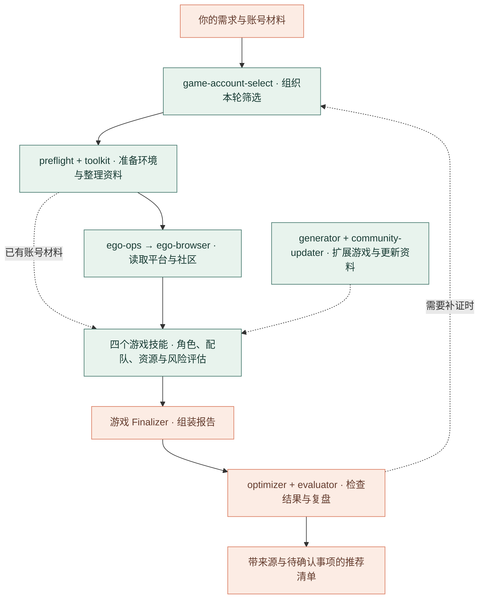

<p align="center">
  
</p>

<h1 align="center">Game Account Select</h1>

<p align="center">
  <strong>挑个合心意的号，开启下一场冒险。</strong><br />
  给 AI 一份愿望清单，让它帮你找号、比价、看阵容。
</p>

<p align="center">
  <strong>简体中文</strong> · <a href="README.en.md">English</a><br />
  <a href="#project-status">项目状态</a> · <a href="#安装">安装</a> · <a href="#试着这样问">用法</a> · <a href="#支持的游戏">支持的游戏</a> · <a href="#项目架构">架构</a> · <a href="https://github.com/PointMountain/game-account-select/issues">反馈</a>
</p>

<p align="center">
  <a href="skills/"></a>
  <a href="LICENSE"></a>
</p>

<p align="center">
  
</p>

Game Account Select 是一套给 Codex、Claude Code 等支持 Agent Skills 的工具使用的游戏账号挑选技能。告诉它你想玩什么、准备花多少、最想要哪些角色，就能拿到带链接、价格、推荐理由和待确认事项的比较清单。

## Project Status

<p align="center">
  
</p>

目前以 **Agent Skills 技能包**的形式使用，仓库版本为 **v0.1.0**。四款游戏已经接入，进展和改动都可以在这里追踪。

[](https://github.com/PointMountain/game-account-select/actions/workflows/verify-game-account-skills.yml)
[](https://github.com/PointMountain/game-account-select/commits/main/)
[](https://github.com/PointMountain/game-account-select/issues)

- [x] 11 个技能，一次安装即可配齐。
- [x] 明日方舟、绝区零、鸣潮、异环的账号评估与比较。
- [x] 按预算和偏好找号，返回带来源的候选清单。
- [x] 社区资料刷新、新游戏技能生成、运行复盘与回归检查。
- [x] 四款游戏均支持螃蟹和盼之的列表搜索、详情读取与跨平台比较。

想看最近在忙什么，可以翻翻 [更新记录](changelogs/)、[项目动态](https://github.com/PointMountain/game-account-select/pulse) 或 [待办与讨论](https://github.com/PointMountain/game-account-select/issues)。

## 安装

<p align="center">
  
</p>

准备好 **Node.js 22+**，在终端执行，按提示选择你使用的 Agent：

```bash
npx skills add https://github.com/PointMountain/game-account-select --skill '*'
```

这会安装全部 11 个技能。完成后，新开一个 Agent 会话就可以使用。

**第一次在线找号**，还需要配置 [ego lite](https://lite.ego.app/) 浏览器，并安装或链接 `ego-browser`、`ego-ops` 技能及对应平台的操作知识。可以先把这句话发给 Agent，按检查结果补齐环境：

```text
用 game-account-preflight 检查找号环境，包括 Node.js、git、gh、
ego-ops 和 ego-browser，告诉我还需要准备什么。
```

四款游戏的双平台操作知识已收录在[配套 ego-ops 版本](https://github.com/PointMountain/jacky-skills/tree/98cd060110c630c78d7e1282e7834dd359aa171b/harness/ego-ops)。安装或更新时，让 Agent 一并检查这些操作是否齐全。

<details>
<summary>按需安装 / 更新技能</summary>

使用交互式安装器选择技能：

```bash
npx skills add https://github.com/PointMountain/game-account-select
```

单游戏评估请一起选择：对应游戏技能、`game-account-toolkit`、`game-account-preflight`、`game-account-skill-optimizer`、`game-account-skill-evaluator` 和 `game-account-community-updater`。要让 Agent 主动找号，再加上 `game-account-select`。

更新已安装的技能：

```bash
npx skills update
```

</details>

## 试着这样问

### 帮我找个号

<p align="center">
  
</p>

把**游戏、预算、区服和最在意的东西**说清楚，剩下的交给 Agent。

```text
用 game-account-select 帮我找明日方舟国服官服号，预算 1500 元以内。
我更在意限定和联动干员，练度够日常用就好。
帮我比较螃蟹和盼之的候选，把价格、亮点、链接和需要问卖家的事列清楚。
```

### 帮我看看这个值不值

<p align="center">
  
</p>

把链接、截图或卖家描述一起发过去：

```text
用 game-account-zenless-zone-zero 看看这个绝区零账号，卖家报价 800 元。
我想接手后就有两队能玩，也想留些抽卡资源。
帮我看看阵容搭配、专属音擎和绑定情况，这个价格值得考虑吗？

账号信息：<粘贴链接、卖家描述，或附上截图>
```

### 这几个号，我该挑哪个

<p align="center">
  
</p>

```text
用 game-account-wuthering-waves 比较下面三个鸣潮账号。
我喜欢的角色是今汐，优先看她的队伍和专武，再看看剩余抽卡资源。
按适合我的程度排个序，说说每个号的取舍。

候选 A：<链接或账号信息>
候选 B：<链接或账号信息>
候选 C：<链接或账号信息>
```

## 你会拿到什么

<p align="center">
  
</p>

一份按你的偏好整理的候选清单，重点都放在一起：

| 你关心的 | 清单里会写 |
| --- | --- |
| 多少钱、去哪看 | 挂牌价格、平台、原始链接 |
| 为什么适合我 | 目标角色、队伍搭配、装备、养成与抽卡资源 |
| 几个号怎么选 | 推荐顺序、各自亮点和价格差异 |
| 还要问卖家什么 | 绑定与实名情况、验号信息、需要补充的截图或数据 |

看到清单后，继续说“把预算提到 2000”“我更想要皮肤”或“重点看看第二个”，就能按新偏好接着比较。

## 支持的游戏

<p align="center">
  
</p>

四款游戏都支持在**螃蟹和盼之**找号、读取详情和比较候选，也可以直接分析你提供的账号材料。

| 游戏 | 会帮你看什么 | 在线找号 |
| --- | --- | --- |
| **明日方舟** | 限定与联动、练度、专精模组、皮肤、资源 | 螃蟹 PXB7、盼之 PZDS |
| **绝区零** | 代理人、影画、专属音擎、配队、菲林母带 | 螃蟹 PXB7、盼之 PZDS |
| **鸣潮** | 共鸣者、共鸣链、专武、配队、抽卡资源 | 螃蟹 PXB7、盼之 PZDS |
| **异环** | S 角色、S 弧盘、觉醒、资源、账号类型 | 螃蟹 PXB7、盼之 PZDS |

想找其他游戏，可以直接说：

```text
用 game-account-skill-generator 为 <游戏名> 创建账号评估技能，
补齐社区资料并通过质量检查后，帮我看看账号。
```

## 项目架构

<p align="center">
  
</p>

可以把这 11 个技能想成一支分工明确的小队：主入口听懂你的需求，浏览器工具找资料，游戏技能看懂账号，最后一起把推荐清单检查好。


```mermaid
flowchart TD
    Request["你的需求与账号材料"] --> Select["game-account-select · 组织本轮筛选"]
    Select --> Runtime["preflight + toolkit · 准备环境与整理资料"]
    Runtime --> Browser["ego-ops → ego-browser · 读取平台与社区"]
    Runtime -. "已有账号材料" .-> Games
    Browser --> Games["四个游戏技能 · 角色、配队、资源与风险评估"]
    Extend["generator + community-updater · 扩展游戏与更新资料"] -.-> Games
    Games --> Finalizer["游戏 Finalizer · 组装报告"]
    Finalizer --> Review["optimizer + evaluator · 检查结果与复盘"]
    Review --> Report["带来源与待确认事项的推荐清单"]
    Review -. "需要补证时" .-> Select
    classDef mint fill:#e8f3ed,stroke:#42766b,color:#183b34
    classDef coral fill:#fcece4,stroke:#d9795d,color:#643c2e
    class Select,Runtime,Browser,Games,Extend mint
    class Request,Finalizer,Review,Report coral
```

| 想了解哪一块 | 从这里看起 |
| --- | --- |
| 一次找号怎样开始、怎样交付 | [主筛选技能](skills/game-account-select/SKILL.md) |
| 各个游戏如何评估账号 | [明日方舟](skills/game-account-arknights/SKILL.md) · [绝区零](skills/game-account-zenless-zone-zero/SKILL.md) · [鸣潮](skills/game-account-wuthering-waves/SKILL.md) · [异环](skills/game-account-neverness-to-everness/SKILL.md) |
| 浏览器、资料和模块怎样配合 | [架构说明](docs/development/architecture.md) |
| 怎样修改技能并验证效果 | [开发流程](docs/development/workflow.md) · [学习闭环](skills/game-account-skill-optimizer/references/learning-loop.md) |

<details>
<summary>更多用法：刷新版本评价 / 本地开发</summary>

想结合新版本重新看角色和装备价值：

```text
用 game-account-community-updater 更新绝区零的社区资料，
再看看前面几个账号的推荐顺序有没有变化。
```

在仓库中列出技能、查看安装组合，或链接本地修改：

```bash
npm run list:skills
npm run list:profiles
npm run link:skills
```

完成修改后验证；需要移除本地链接时运行最后一行：

```bash
npm run dev:check
npm run verify:skills
npm run unlink:skills
```

详细步骤见 [开发流程](docs/development/workflow.md) 与 [环境准备清单](skills/game-account-preflight/references/preflight-checklist.md)。

</details>

---

遇到问题，或想加一个你在玩的游戏，欢迎 [开个 Issue](https://github.com/PointMountain/game-account-select/issues)。带上游戏名、你的需求和遇到的情况，就更容易一起把它做好。

[MIT License](LICENSE) · Made for your next adventure.
